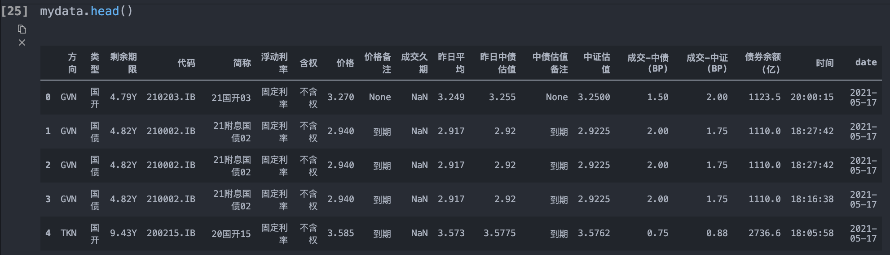
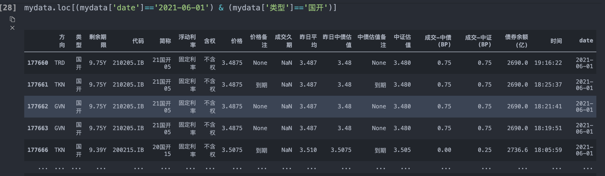
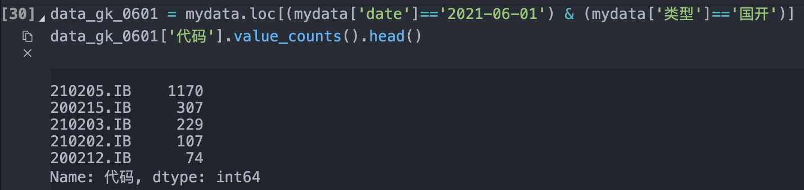

# 利用Python做简单的统计分析

### 以二级利率债成交数据为例

1. ##### 从数据库拉取二级利率债成交数据
```python
import data_organize as do
mydata = do.get_data('secondary_rate_sec')
```

2. ##### 统计指定日期(2021-06-01)不同国开债的成交数量
```python
# 查看数据的前五行
mydata.head()
```



```python
# 构建索引语句对mydata进行筛选，输出以观察数据样本
mydata.loc[(mydata['date']=='2021-06-01') & (mydata['类型']=='国开')]
```


```python
# 为筛选后的子表赋值，并统计代码列的值和对应频数（取前五）
data_gk_0601 = mydata.loc[(mydata['date']=='2021-06-01') & (mydata['类型']=='国开')]
data_gk_0601['代码'].value_counts().head()
```


